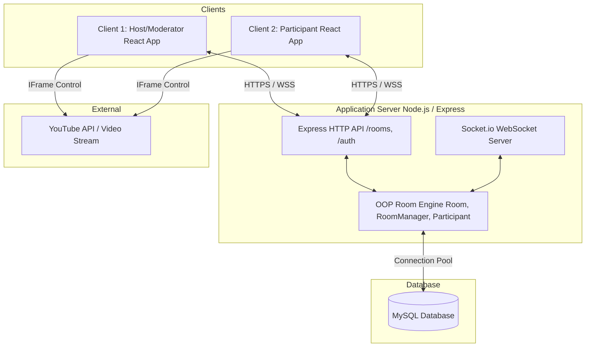

# YouTube Watch Party - System Design & Documentation

Welcome to the comprehensive system design and implementation suite for the **YouTube Watch Party** system. This repository contains the architecture, database schema, frontend/backend integration guides, and scalability blueprints for building a real-time, synchronized YouTube-watching application.

---

## 🚀 System Overview

The system allows users to create or join private rooms, input YouTube video URLs, and watch videos synchronously. Actions such as Play, Pause, and Seek are synchronized in real time using WebSockets. The system enforces Role-Based Access Control (RBAC) to ensure only authorized users (Host and Moderators) can control the playback.

### Core Stack

- **Frontend**: React + JavaScript + Vite, YouTube IFrame API, Socket.io-client, Vanilla CSS / Tailwind.
- **Backend**: Node.js + Express + JavaScript (ES Modules), Socket.io WebSocket server, OOP Room Manager engine.
- **Database**: MySQL (for users, room sessions, audit logs, and persistent chat).
- **Security & Features**: API Rate Limiting (`express-rate-limit`) and an AI-Powered Chatbot (GROQ LLaMA model integration).

### Key Dependencies & Utilities

- **`joi`**: Provides strict schema validation for all incoming HTTP requests to prevent malformed data and mitigate injection attacks.
- **`winston` & `winston-daily-rotate-file`**: Used for robust server logging, error tracking, and daily log rotation instead of standard console logs.
- **`swagger-jsdoc` & `swagger-ui-express`**: Automatically generates interactive API documentation from code configurations.
- **`helmet` & `bcrypt`**: Protects the API with critical HTTP headers and ensures secure password hashing.

---

## 🏗️ System Architecture



---

## 🛡️ Role-Based Access Control (RBAC) Matrix

Permissions are validated dynamically by backend middleware before executing commands.

| Permission                           | Host | Moderator | Participant / Viewer |
| :----------------------------------- | :--: | :-------: | :------------------: |
| **Play/Pause Video**                 | Yes  |    Yes    |          No          |
| **Seek Video Position**              | Yes  |    Yes    |          No          |
| **Change Video URL / Video ID**      | Yes  |    Yes    |          No          |
| **Assign Roles (Promote/Demote)**    | Yes  |    No     |          No          |
| **Kick Participant**                 | Yes  |    No     |          No          |
| **Transfer Host**                    | Yes  |    No     |          No          |
| **Send Chat Messages**               | Yes  |    Yes    |         Yes          |
| **Read Room Details / Participants** | Yes  |    Yes    |         Yes          |

---

## 📖 API Documentation

Interactive API documentation (Swagger UI) is hosted and available for testing endpoints:
👉 **[Swagger UI - API Playground](https://saurabhsrivastav.dev/api-docs/)**

---

## 📂 Project Structure

```
├── .github/                  # GitHub Actions CI/CD Workflows
├── docs/                     # System Design & Implementation Docs
│   ├── architecture.md       # High-level architecture & sequence diagrams
│   ├── backend_guide.md      # Backend APIs and OOP design overview
│   ├── database_schema.md    # MySQL schema and ER logic
│   ├── frontend_guide.md     # Frontend setup and API integration
│   ├── role_guide.md         # Detailed role and RBAC documentation
│   └── VWatch_flow.md        # Real-time WebSocket interaction flows
├── src/                      # Backend Source Code
│   ├── controllers/          # API Route Controllers
│   ├── models/               # Database Models
│   ├── routes/               # Express Routes definition
│   ├── services/             # Business Logic & DB Services
│   ├── websockets/           # Socket.io events and OOP handlers
│   └── ...
├── .env                      # Environment Variables
├── app.js                    # Express Application Setup
├── server.js                 # WebSocket Server & App Entry Point
└── package.json              # Node.js dependencies
```

---

## 📚 Documentation Structure

The design and setup instructions are modularized across the following documents:

1. **[System Architecture & Real-Time Flow](./docs/architecture.md)**
   - High-level system architecture, client-server layout, and deployment boundaries.
   - Detailed sequence diagrams representing room joining, playback sync events, and role updates.

2. **[MySQL Database Schema Design](./docs/database_schema.md)**
   - Entity-Relationship (ER) diagram for MySQL database.
   - Indexing and query performance optimizations.

3. **[Backend Implementation Guide](./docs/backend_guide.md)**
   - Project bootstrap, `package.json` with ES Modules configuration.
   - Complete OOP class code structures for `Room`, `RoomManager`, and `Participant`.

4. **[Role Management Guide](./docs/role_guide.md)**
   - RBAC rules, assignments, and database lifecycle for roles.

---

## 🛠️ Quick Setup Overview (Local Run)

### Backend Setup

1. Setup a MySQL database instance and execute the schema definitions inside [database_schema.md](./docs/database_schema.md).
2. Create a `.env` file based on the example provided in the [Backend Implementation Guide](./docs/backend_guide.md#12-environment-variables-env).
3. Install dependencies:
   ```bash
   npm install
   ```
4. Run the development server:
   ```bash
   npm run dev
   ```

### Frontend Setup

1. Create a `.env` file pointing to your backend:
   ```env
   VITE_BACKEND_URL=http://localhost:5000
   ```
2. Install dependencies and start the Vite server:
   ```bash
   cd watch-party-frontend
   npm install
   npm run dev
   ```
3. Open `http://localhost:5173` in your browser.

---

## ☁️ Deployment (AWS)

This application is designed to be deployed on **Amazon Web Services (AWS)** for robust scalability.

1. **Backend (Node.js/Socket.io)**: Deployed on an **Amazon EC2 Instance**.
   - Uses PM2 or Docker for process management.
   - NGINX is configured as a reverse proxy to handle HTTPS and route WebSocket traffic securely to the Node.js server.
2. **Database (MySQL)**: Hosted on **Amazon RDS (Relational Database Service)**.
   - Ensures high availability, automated backups, and decoupled scalability.
   - The EC2 instance securely connects to the RDS instance via VPC.
