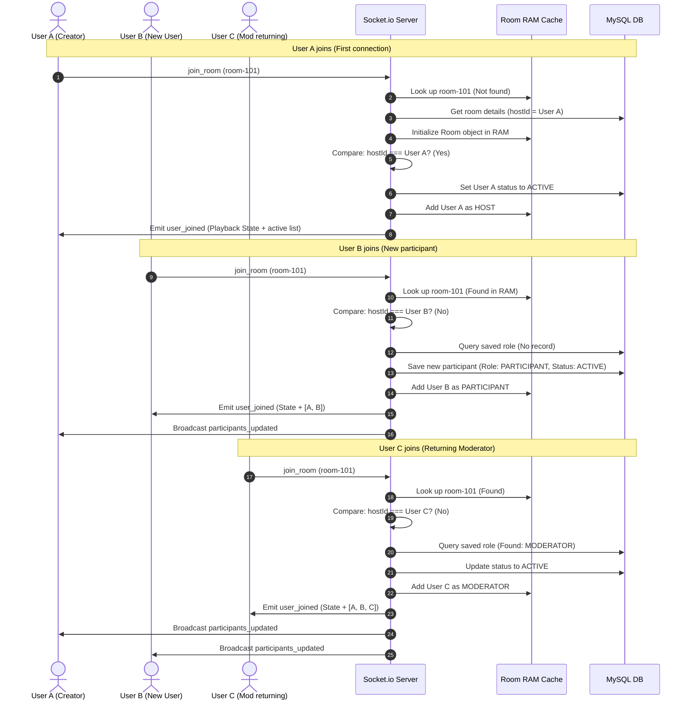
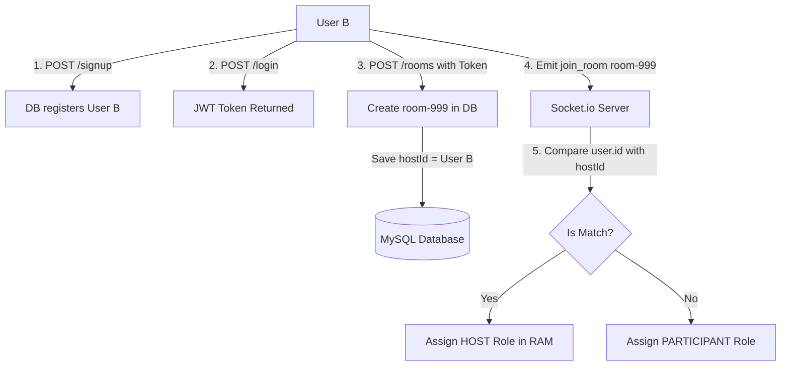
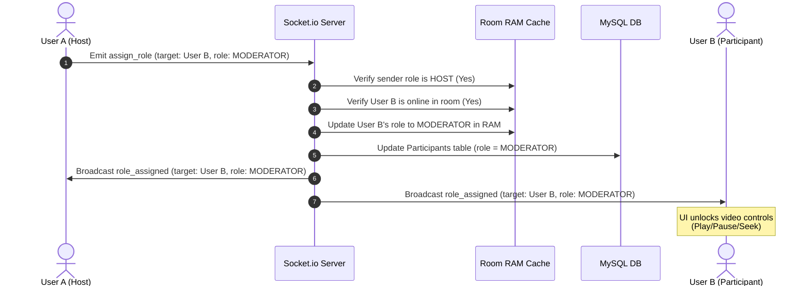

# VWatch API Flow Guide: Visual Flows & Explanations

This document describes the 3 core backend flows of the **YouTube Watch Party (VWatch)** system using clear diagrams and step-by-step breakdowns. Use this guide to easily explain the code logic in technical interviews.

---

## 1. Flow A: 5 Users Joining the Party

This flow demonstrates what happens when **User A** (Room Creator) and 4 subsequent users (**User B, C, D, E**) join a watch room (`room-101`).

### Sequence Diagram

### Explanations:
* **User A (Host)**: Because User A is the room creator, the backend initializes the room in RAM cache, sets User A's role as `HOST` in memory, and sets their database status to `ACTIVE`.
* **User B (New Participant)**: The room already exists in RAM. Since User B is new, no DB participant record exists. The system creates a new entry with the default `PARTICIPANT` role, updates memory, and broadcasts the new active list to User A.
* **User C (Returning Moderator)**: User C was previously promoted to moderator. The DB has this saved. When User C joins, the backend fetches the role `MODERATOR` from MySQL, adds them to memory, and broadcasts the update to everyone else.

---

## 2. Flow B: User B Creating & Owning a Room

This flow shows how a non-host user (like User B) registers, logs in, and starts their own separate room, becoming the Host.

### Flowchart

### Explanations:
1. **Registration & Login**: User B signs up and logs in. A JWT token is generated containing User B's ID.
2. **Room Creation**: User B sends an HTTP POST request to `/api/v1/rooms`. The server creates `room-999` in the database, setting the `hostId` column to User B's ID.
3. **Room Connection**: User B connects to the socket and sends `join_room` for `room-999`. 
4. **Role Assignment**: The backend compares the user's socket ID info (`User B`) with the database `hostId` (`User B`). Because they match, User B is initialized as the **`HOST`** in `room-999` with full controller rights.

---

## 3. Flow C: Host Promoting a Participant to Moderator

This flow shows how the Host (User A) changes the role of User B to a Moderator during a live session.

### Sequence Diagram

### Explanations:
1. **Initiation**: The Host selects User B in the UI and clicks "Make Moderator". The frontend sends the `assign_role` event.
2. **Validation**: The server verifies that the sender is the `HOST` of the active room, and that User B is present in the cache.
3. **Updates**: The server updates User B's role in the RAM cache (immediate effect) and runs an `UPDATE` query on the `Participants` table in MySQL (persistent storage).
4. **Sync**: The server broadcasts `role_assigned` to everyone in the room. The frontend updates the player controls to let the new Moderator play/pause/seek.
