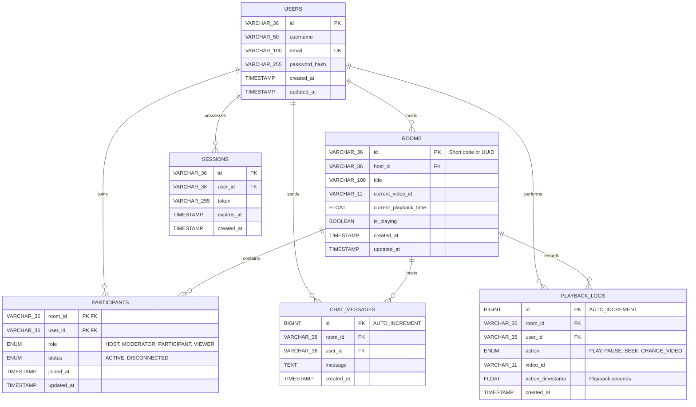

# YouTube Watch Party - MySQL Database Requirements & Schema Design

This document details the MySQL database design for persisting users, watch rooms, session state, access roles, chat history, and playback logs.

---

## 1. Database Entity-Relationship (ER) Diagram

The relationships between entities are defined in the diagram below:



---

## 2. Table Definitions & SQL DDL

Below are the SQL statements required to initialize the database, including keys, indexing, and cascade triggers.

### 2.1 Table: `users`
Stores user authentication details and profiles.
```sql
CREATE TABLE users (
    id VARCHAR(36) PRIMARY KEY,
    username VARCHAR(50) NOT NULL,
    email VARCHAR(100) UNIQUE NOT NULL,
    password_hash VARCHAR(255) NOT NULL,
    created_at TIMESTAMP DEFAULT CURRENT_TIMESTAMP,
    updated_at TIMESTAMP DEFAULT CURRENT_TIMESTAMP ON UPDATE CURRENT_TIMESTAMP,
    INDEX idx_user_email (email)
) ENGINE=InnoDB DEFAULT CHARSET=utf8mb4 COLLATE=utf8mb4_unicode_ci;
```

### 2.2 Table: `rooms`
Stores details about the watch party rooms. The `current_video_id` corresponds to the 11-character YouTube video ID.
```sql
CREATE TABLE rooms (
    id VARCHAR(36) PRIMARY KEY,
    host_id VARCHAR(36) NOT NULL,
    title VARCHAR(100) NOT NULL,
    current_video_id VARCHAR(11) DEFAULT 'dQw4w9WgXcQ' NOT NULL,
    current_playback_time FLOAT DEFAULT 0.0 NOT NULL,
    is_playing BOOLEAN DEFAULT FALSE NOT NULL,
    created_at TIMESTAMP DEFAULT CURRENT_TIMESTAMP,
    updated_at TIMESTAMP DEFAULT CURRENT_TIMESTAMP ON UPDATE CURRENT_TIMESTAMP,
    FOREIGN KEY (host_id) REFERENCES users(id) ON DELETE CASCADE,
    INDEX idx_room_host (host_id)
) ENGINE=InnoDB DEFAULT CHARSET=utf8mb4 COLLATE=utf8mb4_unicode_ci;
```

### 2.3 Table: `participants`
Tracks which users are active in which rooms and details their role permissions.
```sql
CREATE TABLE participants (
    room_id VARCHAR(36) NOT NULL,
    user_id VARCHAR(36) NOT NULL,
    role ENUM('HOST', 'MODERATOR', 'PARTICIPANT', 'VIEWER') DEFAULT 'PARTICIPANT' NOT NULL,
    status ENUM('ACTIVE', 'DISCONNECTED') DEFAULT 'ACTIVE' NOT NULL,
    joined_at TIMESTAMP DEFAULT CURRENT_TIMESTAMP,
    updated_at TIMESTAMP DEFAULT CURRENT_TIMESTAMP ON UPDATE CURRENT_TIMESTAMP,
    PRIMARY KEY (room_id, user_id),
    FOREIGN KEY (room_id) REFERENCES rooms(id) ON DELETE CASCADE,
    FOREIGN KEY (user_id) REFERENCES users(id) ON DELETE CASCADE,
    INDEX idx_participant_lookup (room_id, user_id, status)
) ENGINE=InnoDB DEFAULT CHARSET=utf8mb4 COLLATE=utf8mb4_unicode_ci;
```

### 2.4 Table: `sessions`
Used to manage authentication sessions and JSON Web Token (JWT) blacklists or refresh states.
```sql
CREATE TABLE sessions (
    id VARCHAR(36) PRIMARY KEY,
    user_id VARCHAR(36) NOT NULL,
    token VARCHAR(255) NOT NULL,
    expires_at TIMESTAMP NOT NULL,
    created_at TIMESTAMP DEFAULT CURRENT_TIMESTAMP,
    FOREIGN KEY (user_id) REFERENCES users(id) ON DELETE CASCADE,
    INDEX idx_session_token (token),
    INDEX idx_session_user (user_id)
) ENGINE=InnoDB DEFAULT CHARSET=utf8mb4 COLLATE=utf8mb4_unicode_ci;
```

### 2.5 Table: `chat_messages`
Stores the text conversations in each room.
```sql
CREATE TABLE chat_messages (
    id BIGINT AUTO_INCREMENT PRIMARY KEY,
    room_id VARCHAR(36) NOT NULL,
    user_id VARCHAR(36) NOT NULL,
    message TEXT NOT NULL,
    created_at TIMESTAMP DEFAULT CURRENT_TIMESTAMP,
    FOREIGN KEY (room_id) REFERENCES rooms(id) ON DELETE CASCADE,
    FOREIGN KEY (user_id) REFERENCES users(id) ON DELETE CASCADE,
    INDEX idx_chat_room_time (room_id, created_at DESC)
) ENGINE=InnoDB DEFAULT CHARSET=utf8mb4 COLLATE=utf8mb4_unicode_ci;
```

### 2.6 Table: `playback_logs`
An audit trail capturing synchronized actions. Useful for session analytics, usage insights, and failure recovery.
```sql
CREATE TABLE playback_logs (
    id BIGINT AUTO_INCREMENT PRIMARY KEY,
    room_id VARCHAR(36) NOT NULL,
    user_id VARCHAR(36) NOT NULL,
    action ENUM('PLAY', 'PAUSE', 'SEEK', 'CHANGE_VIDEO') NOT NULL,
    video_id VARCHAR(11) NOT NULL,
    action_timestamp FLOAT NOT NULL COMMENT 'Elapsed video time in seconds at event time',
    created_at TIMESTAMP DEFAULT CURRENT_TIMESTAMP,
    FOREIGN KEY (room_id) REFERENCES rooms(id) ON DELETE CASCADE,
    FOREIGN KEY (user_id) REFERENCES users(id) ON DELETE CASCADE,
    INDEX idx_logs_room_time (room_id, created_at DESC)
) ENGINE=InnoDB DEFAULT CHARSET=utf8mb4 COLLATE=utf8mb4_unicode_ci;
```

---

## 3. Performance & Indexing Justification

1. **Foreign Key Indexes**: MySQL automatically indexes foreign key fields to facilitate joins and maintain referential integrity.
2. **Compound Index `idx_participant_lookup`**: Room operations frequently query `WHERE room_id = ? AND user_id = ? AND status = 'ACTIVE'`. High concurrent reads make this compound index critical to prevent table scans.
3. **Descending Index on Chat**: To retrieve the message history chronologically when a user joins, the compound index `idx_chat_room_time (room_id, created_at DESC)` ensures pagination/limits occur in constant time $O(\log N + K)$.

---

## 4. Key SQL Queries for Application Integration

### 4.1 Check Room Availability and Retrieve State
Used by a user attempting to join a room.
```sql
SELECT r.id, r.title, r.current_video_id, r.current_playback_time, r.is_playing, u.username AS host_name
FROM rooms r
JOIN users u ON r.host_id = u.id
WHERE r.id = ?;
```

### 4.2 Upsert Participant / Re-join
Insert a record if it's the first time joining, or update status/role if re-joining.
```sql
INSERT INTO participants (room_id, user_id, role, status, joined_at)
VALUES (?, ?, 'PARTICIPANT', 'ACTIVE', CURRENT_TIMESTAMP)
ON DUPLICATE KEY UPDATE status = 'ACTIVE', updated_at = CURRENT_TIMESTAMP;
```

### 4.3 Demote/Promote User Role
Only allowed by Hosts.
```sql
UPDATE participants
SET role = ?, updated_at = CURRENT_TIMESTAMP
WHERE room_id = ? AND user_id = ?;
```

### 4.4 Load Message History (Last 50 messages)
```sql
SELECT c.id, c.message, c.created_at, u.username, p.role
FROM chat_messages c
JOIN users u ON c.user_id = u.id
LEFT JOIN participants p ON c.room_id = p.room_id AND c.user_id = p.user_id
WHERE c.room_id = ?
ORDER BY c.created_at DESC
LIMIT 50;
```
