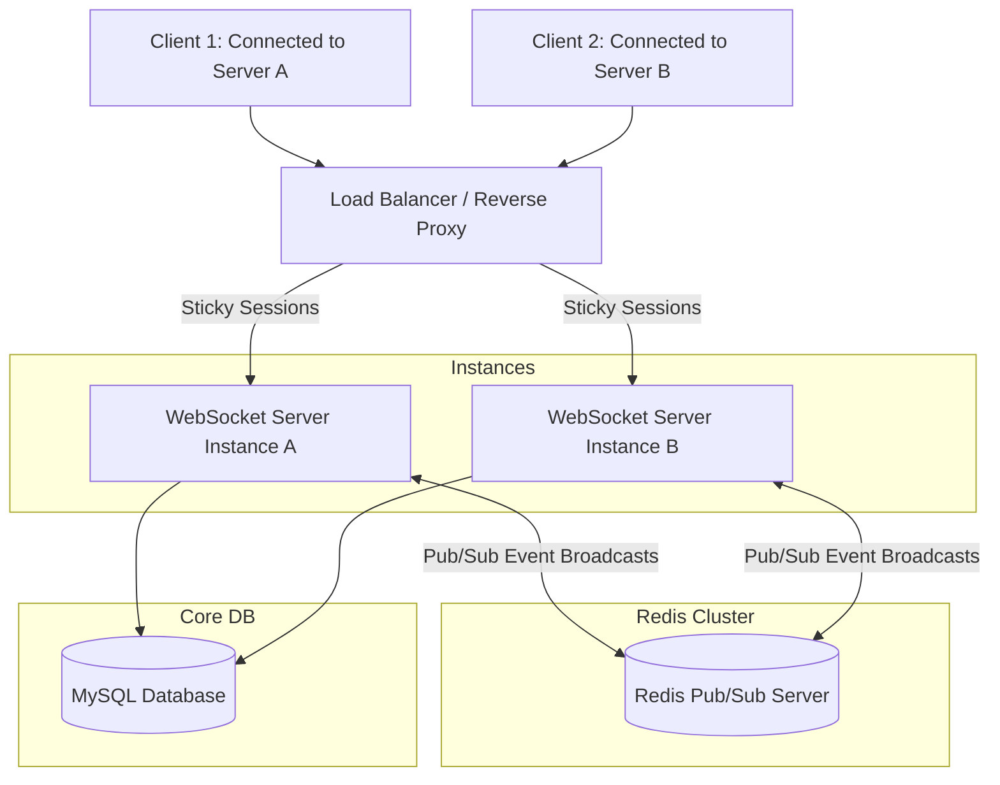

# YouTube Watch Party - Deployment & Scalability Blueprint

This document details the configuration requirements for deploying the Watch Party system to production and scaling it to support 1,000+ concurrent users, 100+ active rooms, and 50+ users per room.

---

## 1. Production Deployment Guide

Deploy the system as a decoupled service layer to minimize hosting overhead and separate static asset delivery from stateful WebSocket streams.

### 1.1 Frontend Deployment (Vercel or Netlify)
- **Framework**: Single Page App (SPA) built via Vite (JavaScript).
- **Build Command**: `npm run build`
- **Output Directory**: `dist`
- **Environment Variables**:
  - `VITE_BACKEND_URL`: Public HTTPS/WSS URL of the Node.js server (e.g., `https://api.watchparty.render.com`).

### 1.2 Backend Deployment (Render or Railway)
- **Runtime**: Node.js (Express + Socket.io + JS).
- **Environment Variables**:
  - `PORT`: Set dynamically by platform (defaults to `10000` or similar).
  - `DATABASE_URL` / `DATABASE_HOST`: Credentials for production MySQL instance.
  - `CORS_ORIGIN`: Set explicitly to the Frontend URL to prevent unauthorized script connections.
- **Infrastructure settings**: Disable Render's auto-suspension (Free tier puts the server to sleep, which breaks persistent socket state). Enable WebSockets/HTTP/2 support.

---

## 2. Horizontal Scaling Blueprint

In a single-instance setup, room mappings and socket connections live exclusively in that server's memory. When scaled horizontally behind a load balancer, users in the same watch room might connect to separate backend processes.



### 2.1 Load Balancer & Sticky Sessions
WebSockets initiate connections through an HTTP handshake that upgrades to WSS. Load balancers (e.g., NGINX, AWS ALB) must use **Sticky Sessions** (Session Affinity via cookies) to ensure that handshake routing maps to the exact same instance that maintains the connection socket.

### 2.2 Redis Pub/Sub Adapter (Horizontal Sync)
By binding Socket.io to a Redis server, events emitted to a room are routed to Redis Pub/Sub, which coordinates and routes the message to all backend instances.

#### Setup Guide:
```bash
npm install redis @socket.io/redis-adapter
```

#### Code Integration (`src/index.js`):
```javascript
import { createClient } from 'redis';
import { createAdapter } from '@socket.io/redis-adapter';

const pubClient = createClient({ url: process.env.REDIS_URL });
const subClient = pubClient.duplicate();

export async function initRedisAdapter(io) {
  await Promise.all([pubClient.connect(), subClient.connect()]);
  io.adapter(createAdapter(pubClient, subClient));
  console.log('Successfully coupled socket.io with Redis adapter.');
}
```

---

## 3. High Concurrent Load Optimization (1,000+ Users)

To sustain high traffic loads and eliminate performance bottlenecks:

### 3.1 Socket Connection Pooling & Limits
- **File Descriptors**: Increase OS limits (`ulimit -n 65535`) on target server machines to prevent `EMFILE: too many open files` errors.
- **Node.js Memory**: Configure Node garbage collection thresholds using `--max-old-space-size=2048` to handle high socket connection buffers.

### 3.2 Database Optimization
- **MySQL Connection Pool**:
  - Configure pool limit dynamically (e.g., `connectionLimit: 100`).
  - Implement read-replicas for rooms: routing write requests (`UPDATE rooms`) to the primary master DB, and user info lookups (`SELECT username`) to read replicas.
- **Debounced Playback Saves**:
  - While client-to-client updates must happen immediately, writing playback seek events to MySQL on *every* scrub will lock the database.
  - Implement **debouncing or bulk updates** using Redis caching. Write active state to Redis, and write to MySQL only when:
    1. A room becomes empty.
    2. At a periodic cron interval (e.g., every 15 seconds).
