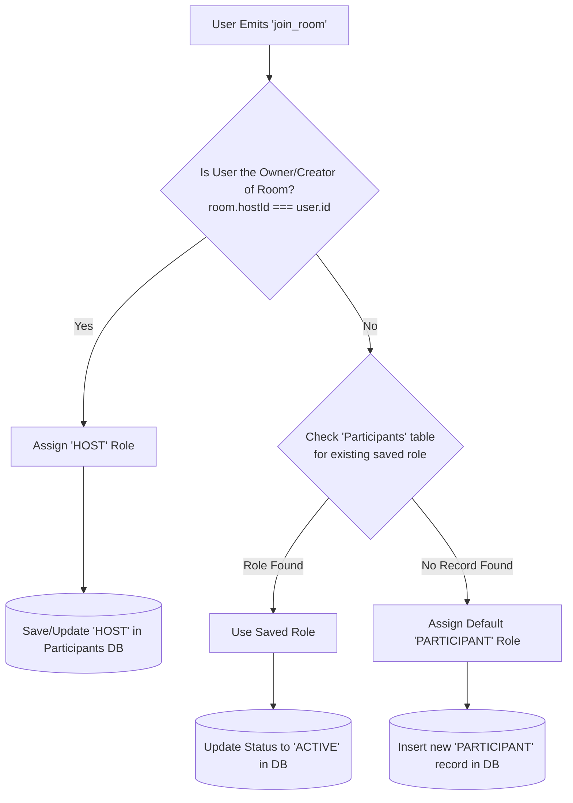

# VWatch Role Management & Flow Guide

This document explains how **Roles** (Host, Moderator, Participant, Viewer) work in the VWatch backend, how they are assigned, and why they are not selected during Signup or Login.

---

## 1. The Core Concept: Roles are "Room-Specific", Not Global

When a user signs up or logs in, they do **not** select or receive a role. Roles are not global. A user's role is **specific to the Watch Room** they are currently in.
  - You can be the **`HOST`** in Room A (because you created it).
  - You can be a simple **`PARTICIPANT`** in Room B.
  - You can be a **`VIEWER`** in Room C.

---

## 2. How Roles are Assigned in the Backend (Step-by-Step)

When a user joins a room (the `join_room` socket event), the backend determines their role using this logic flow:

### Flow Breakdown:
1. **Host Check**:
   - The backend checks if the joining `userId` is the `hostId` (the user who created the room, stored in the `Rooms` database table).
   - If they match: they get the **`HOST`** role.
2. **Database Lookup**:
   - If the user is not the host, the backend checks the `Participants` table in MySQL for an existing entry matching `roomId` and `userId`.
3. **Saved Role Check**:
   - If they have joined this room before and a Moderator or Host promoted them, the database will have their saved role (e.g. `MODERATOR`). The backend loads this role.
4. **Default Assignment**:
   - If they are joining this room for the first time, they default to **`PARTICIPANT`**, and a new record is created in the `Participants` table.

---

## 3. How Role Actions & Permissions Work (For Interviews)

Here is a summary of what each role can do:

| Role | Permissions | Description |
|---|---|---|
| **`HOST`** | Play, Pause, Seek, Change Video, Assign Roles, Kick Users | **The Creator/Owner**: Has full control over the playback, room permissions, and participants. |
| **`MODERATOR`** | Play, Pause, Seek, Change Video | **The Co-Pilot**: Can control the video player synchronization, but cannot kick users or change roles. |
| **`PARTICIPANT`** | Listen & Chat | **Active Guest**: Can send chat messages and watch the synchronized video, but is blocked from play, pause, seek, or changing videos. |
| **`VIEWER`** | Listen Only | **Passive Guest**: Can only watch the sync playback. |

### How Permissions are Blocked
When a playback event like `play_state_change` or `seek` is received, the backend explicitly checks the user's role in the active session. If the user does not have the required role (like HOST or MODERATOR), the action is blocked and a 'Permission Denied' error is sent.

---

## 4. Role Upgrades & Transfers (Dynamic Modification)

Roles are modified in real-time while a room session is running:

1. **Promotion / Demotion (`assign_role` event)**:
   - The `HOST` sends the target user's ID and the new role (e.g., promoting a Participant to Moderator).
   - The backend updates the role in the **In-Memory** cache (so the browser check takes effect immediately) and saves it to the **MySQL Database** (`Participants` table) so the role is remembered if they disconnect and reconnect.
2. **Host Disconnection (Host Reassignment)**:
   - If the `HOST` closes the browser or loses connection, the server automatically reassigns host permissions to ensure the video sync doesn't freeze.
   - Priority rules:
     1. Search for any online **`MODERATOR`** and upgrade them to `HOST`.
     2. If no moderators are online, upgrade the **first participant** in the list.
     3. Broadcast the update to all clients to update the UI controls.
